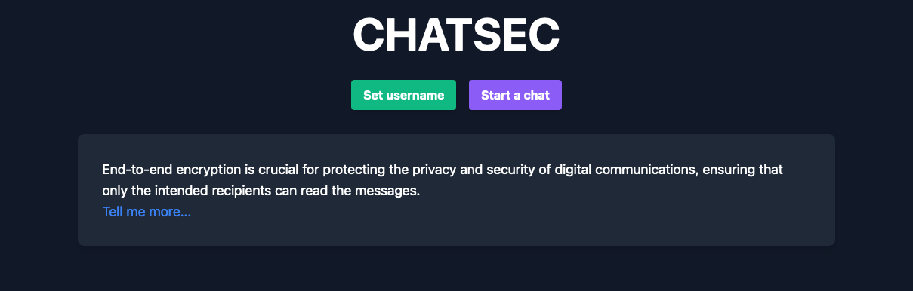

# Chatsec :closed_lock_with_key:

Chatsec (Chat Secure) is a Elixir based end-to-end encrypted chat service build on the [Phoenix framework](https://www.phoenixframework.org/).



### How does it work?

**Summary**
  * Chatrooms can hold a maximum of 2 people.
  * Messages are encrypted/decrypted using a shared secret.
  * Keypairs are generated using the [Web Crypto API](https://developer.mozilla.org/en-US/docs/Web/API/Web_Crypto_API).
  * No keys, logs, IP's or other (telemetry) data is collected/stored.
  * Chat history, usernames and shared secrets are session based.


When a new chat is created, The creator joins the channel and gets a a Elliptic-curve Diffie–Hellman (ECDH) keypair. When the second user joins they also generate a keypair and the handshake process begins. This all happens automatically.

When the handshake process completes, both users have a created a shared secret which is then used for communication. **Messages are only broadcasted once!**

Chat history disappears upon chat deletion or both users leaving the room and thereby closing the session. Refreshing the browser will also remove the chat history.

## Running Chatsec :whale:

The Chatsec project can be hosted on your own server using Docker.
You will need to install `docker-compose` and clone this repository.

#### 1. Generating a key

After the repository is cloned you need to create a .env file containing a `SECRET_KEY_BASE` variable. This key can be generated using `pwgen`.

**! to use this command, keep in mind that you have to have pwgen installed on your system.**

``` sh
    cd chatsec
    echo "SECRET_KEY_BASE=$(pwgen -y 64 1)" > .env 
  ```

#### 2. Configure Traefik
The project uses [Traefik Proxy](https://doc.traefik.io/traefik/) to route the incoming webtraffic to the running Chatsec instance.
Before the docker images can be build, we need to configure the Traefik image in the `compose.yaml`.

Make sure the following lines in the `compose.yaml` file are configured to your domain or IP address.

``` sh
    environment: 
      PHX_HOST: "<YOUR_DOMAIN.com>"
```

and

``` sh
    command: 
      - "--providers.docker.defaultRule=Host(`{{ index .Labels \"com.docker.compose.service\" }}.<YOUR_DOMAIN.com>`)"
```

#### 3. Building and running the compose.yaml

After the .env file is created containing our `SECRET_KEY_BASE` variable, we can start building the `docker images`.
(Make sure you are inside the chatsec folder).

 ``` sh
    docker-compose up -d --build
 ```

This command will build the services needed for Chatsec to function properly. 

That's it! You have build your own instance of Chatsec :partying_face:

## End-to-end tests :robot:

End-to-end tests can be found in the `e2e` folder in the Chatsec repository. This folder contains a handfull of tests created to test the functionality of the application. Very handy in a development environment. To make use of the existing E2E tests, install [Poetry](https://python-poetry.org/docs/) on your system and run `poetry install` in the `e2e` folder.

The end-to-end tests are written in `python` and use `Playwright` to test the functionality of the application.

Before running the tests, make sure your IP-address or domain is in the `e2e/tests/.env` file. You need to create this file yourself! The file structure is very basic and looks like this:

```sh
    IP='<IP>'
    PORT='<PORT>'
```

#### 1. Running the tests

To run the end-to-end tests (make sure you are in the e2e folder, and the application is running):
 ``` sh
    poetry run pytest
 ```
